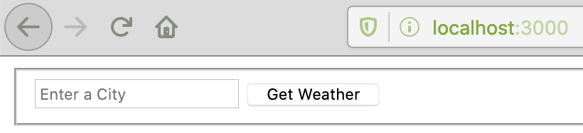

# WeatherApp-CLI

Learn to make API calls and build a Command-Line Weather App.

## Pre-requsites

1. Go to [OpenWeatherMap.org](https://openweathermap.org/appid) and sign up (20 seconds).
2. Install [NodeJS](https://nodejs.org/en/)

## Step 1: Setup the project

1. Create an empty directory named node-weather and run

    ```shell
    npm init
    ```

2. Enter the information needed (Press enter for all defaults is fine).

    My `package.json` file looks like this after first time setup.

    *Note: Yours may look slightly different, that's okay.*

    ```json
    {
    "name": "weatherapp-cli",
    "version": "1.0.0",
    "description": "Learn to make API calls and build a Command Line Weather App.",
    "main": "index.js",
    "scripts": {
        "test": "echo \"Error: no test specified\" && exit 1"
    },
    "repository": {
        "type": "git",
        "url": "git+https://github.com/cjrobbertse/WeatherApp-CLI.git"
    },
    "author": "Christopher Robbertse",
    "license": "ISC",
    "bugs": {
        "url": "https://github.com/cjrobbertse/WeatherApp-CLI/issues"
    },
    "homepage": "https://github.com/cjrobbertse/WeatherApp-CLI#readme"
    }
    ```

3. Create a file named `index.js` - this file contains the code for our application for now.s

## Step 2: Making the API call

To make our API call, we’ll be using a popular npm module called [`request`](https://www.npmjs.com/package/request). `request` has millions of downloads and is a module that simplifies the code needed to make an HTTP `request` in NodeJS.

Install the `request` module into your project

```shell
npm install request
```

To use the `request` module within your code, you must first import the module into the file.

```js
const request = require('request');
```

Pass `request` a target `url` and the request returns a callback function. We check for an error request and log the error. Otherwise, we log the response's body.

```js
request(url, (error, response, body) => {
    if(error) {
        console.log('error:', error);
    } else {
        console.log('body:', body);
    }
});
```

Now we need to define what the `url` is.

By reading the OpenWeatherMap's current weather API [documentation](https://openweathermap.org/current), you can find out what the URL to use for the request.

### Tasks: API URL

1. Find the template URL for the current weather on the [OpenWeatherMap](https://openweathermap.org/current) website (by city name only).
2. Assign a new variable called `url` that is equal to the API call url.

    *Hint: Use a template string so that we can substitute in a `cityName` variable. -> [Template literals](https://developer.mozilla.org/en-US/docs/Web/JavaScript/Reference/Template_literals)*

3. Assign a new variable called `cityName` and make it equal to the name of a city (string)
4. Add '`$`' in front of `{cityName}` to symbolise a JavaScript variable.
5. Run your code now you should see a response from OpenWeatherMap.org

    ```shell
    $ node index.js
    body: {"cod":401, "message": "Invalid API key. Please see http://openweathermap.org/faq#error401 for more info."}
    ```

    The `401` status is okay for now; we still need to set up an API key to use the service.

If nothing happens or you get an error message, check your `index.js` file looks like this:

```js
const request = require('request');

let cityName = 'london';
let url = `http://api.openweathermap.org/data/2.5/weather?q=${cityName}`;

request(url, function (err, response, body) {
    if (err) {
        console.log('error:', error);
    } else {
        console.log('body:', body);
    }
});
```

### Tasks: API key

Now we must provide a valid API key to be allowed to access to the weather data.

1. On [this](https://openweathermap.org/appid) page, we can see that we must add `&APPID={APIKEY}` to the end of our URL.
2. Assign a new variable called `apiKey` and give it the value of your default API key, found [here](https://home.openweathermap.org/api_keys).
3. Run your code. You should see the full response from OpenWeatherMap.org.

    ```shell
    $ node index.js
    body: {"coord":{"lon":-0.13,"lat":51.51},"weather":[{"id":310,"main":"Drizzle","description":"light intensity drizzle rain","icon":"09n"},{"id":500,"main":"Rain","description":"light rain","icon":"10n"}],"base":"stations","main":{"temp":282.14,"pressure":986,"humidity":100,"temp_min":280.93,"temp_max":283.15},"visibility":6000,"wind":{"speed":5.7,"deg":250},"rain":{"1h":0.25},"clouds":{"all":75},"dt":1574887764,"sys":{"type":1,"id":1412,"country":"GB","sunrise":1574840259,"sunset":1574870326},"timezone":0,"id":2643743,"name":"London","cod":200}
    ```

If you get an error, check your `index.js` file looks like this:

```js
const request = require('request');

const apiKey = '612fe773df9f2bd1ccca12a40db1e00e';
let cityName = 'london';
let url = `http://api.openweathermap.org/data/2.5/weather?q=${cityName}&APPID=${apiKey}`;

request(url, function (err, response, body) {
    if (err) {
        console.log('error:', error);
    } else {
        console.log('body:', body);
    }
});
```

If your `index.js` file does look like this, but you see the response:

```shell
$ node index.js
body: {"cod":401, "message": "Invalid API key. Please see http://openweathermap.org/faq#error401 for more info."}
```

Your API key is still invalid as it takes roughly 10 minutes from creating your OpenWeatherMaps account to validate your default API key.

## Cleaning up our response

We want to pull the temperature out of data response. To do that first, we assign the response body into a JSON object.

```js
let weather = JSON.parse(body);
```

You can access values within the JSON by using the key in tree order.

For example, you can get the value of humidity like this.

```js
weather.main.humidity
```

### Tasks

1. Create a variable `message` and assign it to a template string containing a message with the **temperature** and the **name of the city**.
2. Log the message to the console.
3. Run the program. Your output should look something like this

    ```shell
    $ code index.js
    It's 282.45 degrees in London!
    ```

Your `index.js` file should look like this:

```js
const request = require('request');

const apiKey = '612fe773df9f2bd1ccca12a40db1e00e';
let cityName = 'london';
let url = `http://api.openweathermap.org/data/2.5/weather?q=${cityName}&APPID=${apiKey}`;

request(url, function (err, response, body) {
    if (err) {
        console.log('error:', error);
    } else {
        let weather = JSON.parse(body);
        let message = `It's ${weather.main.temp} degrees in ${weather.name}!`;
        console.log(message);
    }
});
```

The response `temp` doesn't look right; this is because the default response `temp` is in Kelvin.
We could convert the Kelvin value into Celsius manually (`'C = K - 273.15`).

```js
let message = `It's ${weather.main.temp - 273.15} degrees in ${weather.name}!`;
```

```shell
$ node index.js
It's 6.8799999999999955 degrees in London!
```

But that still isn't great. So instead we ask the API for a different type of data

The beauty of using APIs is that you can make add parameters to the requests that affect the response. We want the units of the response to be in degrees Celsius. So we add the parameter `units=metric` to the request.

```js
let url = `http://api.openweathermap.org/data/2.5/weather?q=${cityName}&units=metric&APPID=${apiKey}`;
```

```shell
$ node index.js
It's 6.77 degrees in London!
```

## Add interaction

We want to be able to enter the city-name value ourselves, not hardwiring it in the code.

The package [`yargs`](https://www.npmjs.com/package/yargs) allows us to parse command line input as arguments for our application.

Install yargs

```shell
npm install yargs
```

Yargs works by exposing any variables we use in the console onto the argv object. We import and access this object like so:

```js
const argv = require('yargs').argv;
```

We’ll use the **flag** of c for city:

Let's have our city variable equal either `argv.c` OR if no variable is input, we’ll have a default city value of `London`:

```js
let city = argv.c || 'london';
```

Now when we run the app, in a variable called `c`.

```shell
$ node index.js -c reading
It's 5.64 degrees in Reading!
```

Your `index.js` file should look like this:

```js
const request = require('request');
const argv = require('yargs').argv;

const apiKey = '612fe773df9f2bd1ccca12a40db1e00e';
let cityName = argv.c || 'london';
let url = `http://api.openweathermap.org/data/2.5/weather?q=${cityName}&units=metric&APPID=${apiKey}`;

request(url, function (err, response, body) {
    if (err) {
        console.log('error:', error);
    } else {
        let weather = JSON.parse(body);
        let message = `It's ${weather.main.temp} degrees in ${weather.name}!`;
        console.log(message);
    }
});
```

## Creating our Server (with Express JS)

Create a new file called `server.js`.

The first thing we need to do is get our server up and running. We’re going to use [Express](https://expressjs.com/) to accomplish this. Express is a minimalist web framework for Node.js — Express makes it very easy to create and run a web server with Node.

Install express into your project via the console:

```shell
npm install express
```

Once installed, we’re going to copy the boilerplate Express starter app from the [Express documentation](https://expressjs.com/en/starter/hello-world.html):

```js
const express = require('express');
const app = express();

app.get('/', function (req, res) {
  res.send('Hello World!')
})

app.listen(3000, function () {
  console.log('Example app listening on port 3000!')
})
```

Above is an example of the simplest application that we can create with Express. First we require the express package that was just installed. Then, we create an instance named `app` by invoking Express.

The `app.get('/'...` means we are specifically focusing on the root URL (/). If we visit the root URL, Express will respond with “Hello World!”.

The `app.listen(...` shows we are creating a server that is listening on port 3000 for connections.

You can run it:

```shell
$ node server.js
Example app listening on port 3000!
```

Now open your browser and to the URL: `http://localhost:3000/` and you should see the text "Hello World!"

Awesome! You’ve just created a server with Node.js and Express!

## Setting up the index view

Instead of responding with text when someone visits our root route, we’d like to respond with an HTML file. For this, we’ll be using EJS ([Embedded JavaScript](http://www.embeddedjs.com/)). EJS is a templating language.

In order to use EJS in Express, we need to set up our template engine:

>A template engine enables you to use static template files in your application. At runtime, the template engine replaces variables in a template file with actual values, and transforms the template into an HTML file sent to the client. This approach makes it easier to design an HTML page.

The short version is that EJS allows us to interact with variables and then dynamically create our HTML based on those variables! (This will make a lot more sense later in the tutorial)

First, we’ll install ejs in the terminal:

```shell
npm install ejs
```

EJS is accessed by default in the `views` directory. So create a new folder named `views` in your directory. Within that views folder, add a file named index.ejs. Think of our `index.ejs` file as an HTML file for now.

---

Real quick, here’s what our file structure should look like thus far:

```tree
|-- weather-app
   |-- views
      |-- index.ejs
   |-- package.json
   |-- server.js
```

---

Awesome, here’s a boilerplate for our `index.ejs` file. I’m not going to go over this file as this is not an HTML tutorial, but it should be pretty straight forward as we’re not using any EJS just yet. The html is just a form with one input for a city, and one submit button:

```html
<!DOCTYPE html>
<html>
  <head>
    <meta charset="utf-8">
    <title>Test</title>
    <link rel="stylesheet" type="text/css" href="/css/style.css">
    <link href='https://fonts.googleapis.com/css?family=Open+Sans:300' rel='stylesheet' type='text/css'>
  </head>
  <body>
    <div class="container">
      <fieldset>
        <form action="/" method="post">
          <input name="city" type="text" class="ghost-input" placeholder="Enter a City" required>
          <input type="submit" class="ghost-button" value="Get Weather">
        </form>
      </fieldset>
    </div>
  </body>
</html>
```

Once you have the above code copied into your `index.ejs` file, you’re almost done! The final thing we need to do is replace our `app.get` code from:

```js
app.get('/', function (req, res) {
    res.send('Hello World!');
});
```

Above is the old code where we send the text ‘Hello World!’ to the client. Instead, we want to send our index.ejs file:

```js
app.get('/', function (req, res) {
    res.render('index');
});
```

Instead of using res.send, we use res.render when working with a templating language. res.render will render our view, then send the equivalent HTML to the client.

At this point, wee can test again by running:

```shell
$ node server.js
Example app listening on port 3000!
```



## Adding a CSS File

Yours will look a little less ‘pretty’ than mine. That’s because I’m making use of a css file to style my HTML. Here’s how we get our CSS to work:

You’ll need to add a new folder to our project called public. Within that folder create a css folder, and finally create a file named style.css. Here’s your new file structure:

```tree
|-- weather-app
   |-- views
      |-- index.ejs
   |-- public
      |-- css
         |-- style.css
   |-- package.json
   |-- server.js
```

Express wont allow access to this file by default, so we need to expose it with the following line of code:

```js
app.use(express.static('public'));
```

This code allows us to access all of the static files within the ‘public’ folder.

Finally, we need our CSS. Since this isn’t a CSS course, I’m not going to be going over the specifics, but if you’d like to use my CSS, you can copy it from [here](https://github.com/bmorelli25/simple-nodejs-weather-app/blob/master/public/css/style.css).

## Setting up our POST Route

By now, your server.js file should look like this:

```js
const express = require('express');
const app = express();

app.use(express.static('public'));

app.set('view engine', 'ejs');

app.get('/', function (req, res) {
    res.render('index');
});

app.listen(3000, function () {
    console.log('Example app listening on port 3000!');
});
```

We have one get route, and then we create our server. However, for our application to work, we need a post route as well. If you look at our `index.ejs` file, you can see that our form is submitting a post request to the `/` route:

```html
<form action="/" method="post">
```

Now that we know where our form is posting, we can set up the route! A post request looks just like a get request, with one minor change:

```js
app.post('/', function (req, res) {
  res.render('index');
})
```

But instead of just responding with the same html template, lets access the name of the city the user typed in as well. For this we need to use an *Express Middleware*.

Express is a minimalist framework. However, we can make use of *Middleware* (functions that have access to the `req` and `res` bodies) in order to preform more advanced tasks.

We’re going to make use of the `body-parser` middleware. `body-parser` allows us to make use of the key-value pairs stored on the `req-body` object. In this case, we’ll be able to access the city name the user typed in on the client side.

To use `body-parser`, we must install it first:

```shell
npm install body-parser --save
```

Once installed, we can require it, and then make use of our middleware with the following line of code in our server.js

const bodyParser = require('body-parser');
// ...
// ...app.use(bodyParser.urlencoded({ extended: true }));

For the scope of this project, it’s not necessary you understand exactly how that line of code works. Just know that by using body-parser we can make use of the req.body object.

Finally, we can now update our post request to log the value of ‘city’ to the console.

app.post('/', function (req, res) {
  res.render('index');
  console.log(req.body.city);
})

Lets test it!

node server.js// Example app listening on port 3000!

Now open your browser and visit: localhost:3000, type a city name into the field and hit enter!

If you go back to your command prompt, you should see the city name displayed in the prompt! Awesome, you’ve now successfully passed data from the client to the server!